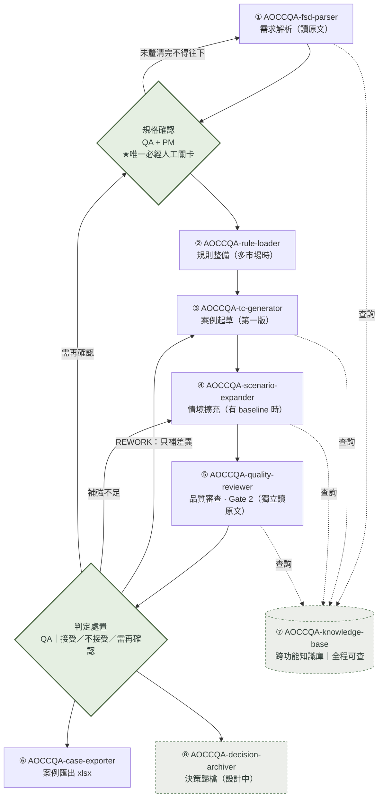

# AOCC QA Skill — 使用規範與情境（Use Case）

ASUS EC（Magento）QA 測試需求分析與 Test Case 產線所使用的一組 Claude Skill。本 repo 記錄每個 skill 的**定義、用途、使用規範（責任邊界）、輸入/輸出、觸發詞與使用情境**，並說明它們如何串接成一條產線。

---

## 產線總覽

這組 skill 對應一條「需求 → 分析 → 規則 → 產案 → 審查 → 交付」的測試案例產線，分為三個 Phase：

| Phase | 階段 | 主要 Skill | 執行者 |
|-------|------|-----------|--------|
| A | 需求解析 | `AOCCQA-fsd-parser` | Skill |
| A | 規格確認（★唯一必經人工關卡） | —（人工） | QA + PM |
| A | 規則整備 ① | `AOCCQA-rule-loader` | Skill |
| B | 案例起草 | `AOCCQA-tc-generator` | Skill |
| B | 情境擴充 | `AOCCQA-scenario-expander` | Skill |
| B | 品質審查 ③（Gate 2） | `AOCCQA-quality-reviewer` | Skill |
| B | 判定處置 | —（人工） | QA |
| C | 案例匯出 | `AOCCQA-case-exporter` | Skill |

輔助：`AOCCQA-knowledge-base`（跨功能知識庫，全程可查，見下方索引第 7 支）。

### 三大鐵則（貫穿全線）

1. **原始檔單次讀取**：只有 `AOCCQA-fsd-parser`（解析）與 `AOCCQA-quality-reviewer`（獨立查核原文）可接觸原始來源；中間步驟一律引用 Requirement ID，不重讀原始檔。
2. **唯一必經人工關卡**：「規格確認」由 QA＋PM 執行，未取得釐清結論不得往下。
3. **審查刻意隔離**：`AOCCQA-quality-reviewer` 不吃 Requirement Matrix，獨立重讀原文，避免沿用 parser 視角而一起漏測。

---

## 流程圖（Flow Chart）

> 實線＝主流程；虛線＝回流（會反覆執行）；點線＝全程可查的知識庫。方框＝Skill 自動執行；菱形＝QA 人工判斷關卡。此為「預期／典型」串接，實際用哪幾步依情境而定（步驟可跳過、可回流、可單獨呼叫）。

互動視覺版（含各步觸發詞、產出、每個情境的可展開流程圖）：[`diagrams/AOCCQA_workflow_and_scenarios.html`](diagrams/AOCCQA_workflow_and_scenarios.html)

---

## Skill 索引

| # | Skill | 版本 | Phase | 一句話定位 | 文件 |
|---|-------|------|-------|-----------|------|
| 1 | `AOCCQA-fsd-parser` | 1.3.2 | A | 把任何規格來源解析成給 PM 看的六段需求分析報告 | [docs](docs/01-AOCCQA-fsd-parser.md) |
| 2 | `AOCCQA-rule-loader` | 1.0.0 | A | 把散落的市場規則整理成可追溯的 Rule Context | [docs](docs/02-AOCCQA-rule-loader.md) |
| 3 | `AOCCQA-tc-generator` | 1.4.1 | B | 把已確認需求展開成 7 欄 Test Case 初稿 | [docs](docs/03-AOCCQA-tc-generator.md) |
| 4 | `AOCCQA-scenario-expander` | 1.0.2 | B | 對照合格 baseline 補強覆蓋缺口 | [docs](docs/04-AOCCQA-scenario-expander.md) |
| 5 | `AOCCQA-quality-reviewer` | 20.1.0 | B | 第二人視角獨立重讀原文，雙向查核報告 | [docs](docs/05-AOCCQA-quality-reviewer.md) |
| 6 | `AOCCQA-case-exporter` | 1.0.0 | C | 把案例＋Jira 單套官方模板匯出 xlsx | [docs](docs/06-AOCCQA-case-exporter.md) |
| 7 | `AOCCQA-knowledge-base` | 1.0.0 | 全程 | 跨功能知識庫（名詞/關係/測試點/歷史單），**不在流程順序內、全程可查** | [docs](docs/07-AOCCQA-knowledge-base.md) |
| 8 | `AOCCQA-decision-archiver` | 1.2.0 | D | 把確認出的功能定義與規則沉澱成知識條目（**設計中，尚未併入本 repo 備份**） | [docs](docs/10-AOCCQA-decision-archiver.md) · [repo](https://github.com/Verna0519/AOCCQA-decision-archiver) |

> 1–6 為走產線主順序的核心 skill；第 7 支 `AOCCQA-knowledge-base` 不是流程中的一步，而是全程可查的共用知識庫；第 8 支 `AOCCQA-decision-archiver` 為產線最後的獨立步驟，設計中；已有獨立來源 repo（[AOCCQA-decision-archiver](https://github.com/Verna0519/AOCCQA-decision-archiver)，v1.2.0），但尚未併入本 repo 的原始檔備份區。所有 skill 名稱（含 `skills/` 資料夾與 `docs/` 檔名）統一為 `AOCCQA-*`；僅各 `SKILL.md` 內的 `name:`（實際呼叫 ID）維持小寫 `aoccqa-*`。

---

## 快速使用情境對照

| 我想做的事（手動測試工程師常說的話） | 用哪個 skill |
|-----------|-------------|
| 「這張 Confluence FSD／PRD 到底要測什麼」「幫我做測試需求分析」「這份規格有沒有缺漏、前後矛盾」「改版了、最終版是哪個」「截圖跟內文對不上」「整理釐清問題丟給 PM／RD」 | `AOCCQA-fsd-parser` |
| 「這功能要上哪些國家／站台」「各國幣別、稅、語系、時區規則」「Guest／Member／Admin 權限規則」「哪些後台設定會影響 Pass／Fail」「資格、排除規則整理成 Rule Context」 | `AOCCQA-rule-loader` |
| 「幫我寫測試案例」「產 test case／測項初稿」「規劃測試覆蓋」「正向、負向、邊界要測哪些」「狀態流轉怎麼測」「把 Requirement 轉成測項」 | `AOCCQA-tc-generator` |
| 「舊測案不夠完整、想補測項」「回歸測試要補哪些」「狀態轉換／身分別（Guest vs Member）有沒有漏測」「拿既有 xlsx 補強覆蓋」 | `AOCCQA-scenario-expander` |
| 「幫我審這份分析報告」「有沒有漏測」「有沒有捏造或超出文件的測項」「技術值、公式、錯誤訊息有沒有抄錯」「Gate 2 審查」 | `AOCCQA-quality-reviewer` |
| 「案例匯出成 Excel」「套 AOCC 官方模板」「產 Test_Case 檔」「接 Jira 單打包成交付檔」 | `AOCCQA-case-exporter` |
| 「這個名詞／狀態值／錯誤訊息是什麼意思」「這個金額／折扣公式怎麼算」「這個後台設定對應前台哪裡」「Magento／AOM／EC 資料流」「這功能以前測過哪些、有沒有歷史單／回歸點」「某頁面有哪些區塊」 | `AOCCQA-knowledge-base` |

---

## 使用情境（不是每次都七支全用）

同一條產線，依情境決定哪幾步會用、跳過或重複。互動視覺版見 [`diagrams/AOCCQA_skill_roles_and_scenarios.html`](diagrams/AOCCQA_skill_roles_and_scenarios.html)。

| 情境 | 說明 | 使用的步驟 |
|------|------|-----------|
| 1. 新需求·跨市場·完整流程 | 全新功能、多市場、有相鄰既有案例可補強 | 七支全用 |
| 2. 新需求·單一市場·無既有案例（最常見） | 單一市場、無舊案例 → 跳過 AOCCQA-rule-loader、AOCCQA-scenario-expander | AOCCQA-fsd-parser → 規格確認 → AOCCQA-tc-generator → AOCCQA-quality-reviewer → 判定 → AOCCQA-case-exporter |
| 3. 既有功能異動·補強路徑 | 已有完整舊案例 → 以補強為主，不重建第一版 | 跳過 AOCCQA-tc-generator，改走 AOCCQA-scenario-expander |
| 4. 規格不足·早停 | AOCCQA-fsd-parser 回 BLOCKED → 後面全停，先補件 | 只用 AOCCQA-fsd-parser |
| 5. 審查判定 REWORK·回流 | reviewer 找到漏測 → AOCCQA-tc-generator 只補差異、reviewer 只查新增 | AOCCQA-tc-generator / AOCCQA-quality-reviewer 重複呼叫 |
| 6. 單點呼叫 | skill 可獨立呼叫：AOCCQA-case-exporter 只出檔 / AOCCQA-quality-reviewer 健檢 / AOCCQA-fsd-parser 整理釐清問題 | 只用其中一支 |

**三條最重要、也最容易被破壞的設計**：規格沒確認不往下（情境 4）、reviewer 不看需求清單才審得出問題、出檔只搬不改。

---

## 原始檔備份（skills/）

[`skills/`](skills/) 收錄 7 支 skill 的原始 `SKILL.md` 與其 references／scripts／assets，作為版本備份：

| Skill | 版本 | 來源 Repo | 附帶檔案 |
|-------|------|-----------|---------|
| `AOCCQA-fsd-parser` | 1.3.2 | [AOCCQA-fsd-parser](https://github.com/Verna0519/AOCCQA-fsd-parser) | `references/report-template.html` |
| `AOCCQA-rule-loader` | 1.0.0 | [AOCCQA-Rule-Loader](https://github.com/Verna0519/AOCCQA-Rule-Loader) | `agents/openai.yaml` |
| `AOCCQA-tc-generator` | 1.4.1 | [AOCCQA-tc-generator](https://github.com/Verna0519/AOCCQA-tc-generator/tree/main/aoccqa-tc-generator) | `references/coverage-and-examples.md` |
| `AOCCQA-scenario-expander` | 1.0.2 | [AOCCQA-scenario-expander](https://github.com/Verna0519/AOCCQA-scenario-expander) | `agents/openai.yaml` |
| `AOCCQA-quality-reviewer-v201` | 20.1.0 | [AOCCQA_quality_reviewer](https://github.com/Verna0519/AOCCQA_quality_reviewer) | — |
| `AOCCQA-case-exporter` | 1.0.0 | [AOCCQA_case_exporter](https://github.com/Verna0519/AOCCQA_case_exporter) | `scripts/export_test_cases.py` |
| `AOCCQA-knowledge-base` | 1.0.0 | [AOCCQA_glossary](https://github.com/Verna0519/AOCCQA_glossary/tree/main/skill/aoccqa-knowledge-base) | `references/` 13 個資料檔（glossary 約 472K 等） |

> 本區 7 支 skill 的原始檔已於 2026-08-01 由各自的**來源 GitHub repo**（見上表「來源 Repo」欄）重新同步，版號一律以來源 repo 的 `SKILL.md`（`metadata.version`）為準（各 repo `main` 最新 commit）。`AOCCQA-fsd-parser` 為雲端 skill，依來源 repo v1.3.2 重建；`AOCCQA-case-exporter` 以獨立 `AOCCQA_case_exporter` repo（v1.0.0）為準——該 repo 不含 `Test_Case_Template_Claude.xlsx`，故本次同步移除該範本（範本仍可於 `AOCCQA-tc-generator` bundle 內的 `AOCCQA-case-exporter/assets/` 取得）；`AOCCQA-knowledge-base` 來源為 `AOCCQA_glossary` repo 的 `skill/aoccqa-knowledge-base/`（v1.0.0）。`AOCCQA-decision-archiver`（v1.2.0）目前仍設計中，未併入本備份區。

---

## 相關文件

- **Skill 說明 · 工作流程 · 使用情境（互動版，推薦）**：[`diagrams/AOCCQA_workflow_and_scenarios.html`](diagrams/AOCCQA_workflow_and_scenarios.html) — 八支 skill 說明、各步觸發詞與產出、六情境含可展開流程圖
- **流程圖（視覺版）**：[`diagrams/AOCCQA_flow_diagram.html`](diagrams/AOCCQA_flow_diagram.html) — 泳道 + 回流路徑 SVG
- **角色與使用情境（視覺版）**：[`diagrams/AOCCQA_skill_roles_and_scenarios.html`](diagrams/AOCCQA_skill_roles_and_scenarios.html)
- [完整產線流程圖說明（文字版）](workflow.md)
- [專案自訂指示（orchestration）](custom-instructions.md)
- 各 skill 詳細說明見 [`docs/`](docs/)
